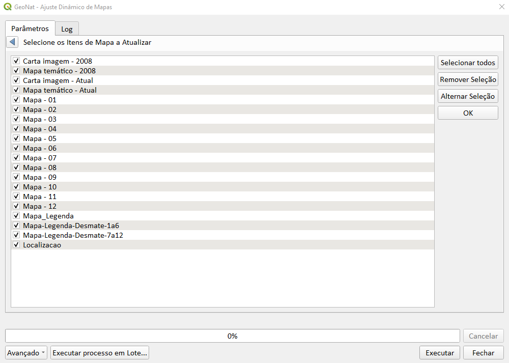

# GeoNat Layout Automation

<p align="center">


</p>

---

## Overview

GeoNat Layout Automation is a PyQGIS automation toolkit designed for dynamic cartographic layouts and automated map production workflows.

The project focuses on:

- Dynamic map layouts
- Automated cartographic production
- Layout element synchronization
- Scale automation
- Atlas workflows
- GIS production optimization

---

## Features

### Dynamic Layout Automation

- Automatic layout updates
- Dynamic labels
- Automated legends
- Scale synchronization

---

### Cartographic Production

- Batch map generation
- Automated exports
- PDF production workflows
- Atlas generation

---

### PyQGIS Integration

- QgsLayout
- QgsLayoutItemMap
- QgsPrintLayout
- QgsProject
- LayoutManager automation

---

## Technologies

- Python
- PyQGIS
- QGIS Layout API
- GDAL

---

## Installation

```bash
git clone https://github.com/CleberSebrian/GeoNat-Layout-Automation.git
```

---

## Usage

1. Open QGIS
2. Load project
3. Execute automation scripts
4. Generate cartographic outputs

---

## Screenshots

### Dynamic Layout Automation



---

## Use Cases

- Environmental reports
- Territorial management
- Automated atlas generation
- Institutional cartography
- GIS production pipelines

---

## Repository Structure

```text
GeoNat-Layout-Automation/
│
├── README.md
├── requirements.txt
├── scripts/
└── images/
    └── layout_automation.png
```

---

## Future Improvements

- Automatic north arrow updates
- Dynamic grids
- Layout templates
- Multi-page atlas workflows
- Advanced export automation

---

## License

MIT License

---

## Author

### Cleber Sebrian

GIS Developer focused on:

- PyQGIS
- GIS Automation
- Cartographic Production
- Remote Sensing
- Geospatial Systems

---

## Keywords

`QGIS` `PyQGIS` `Cartography` `GIS Automation` `Atlas` `Map Production` `Python`
